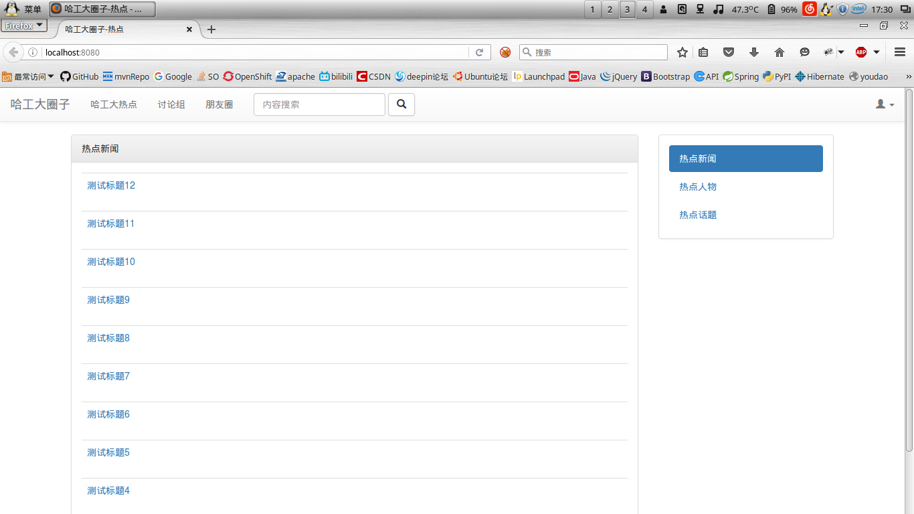
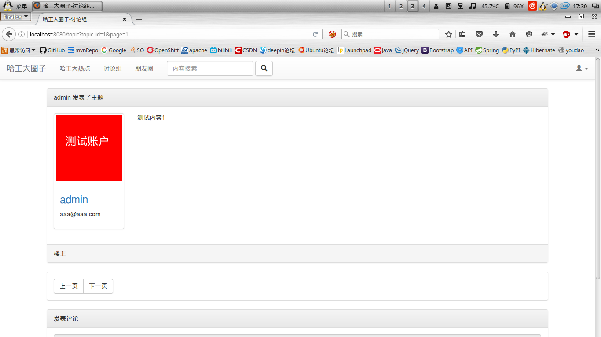
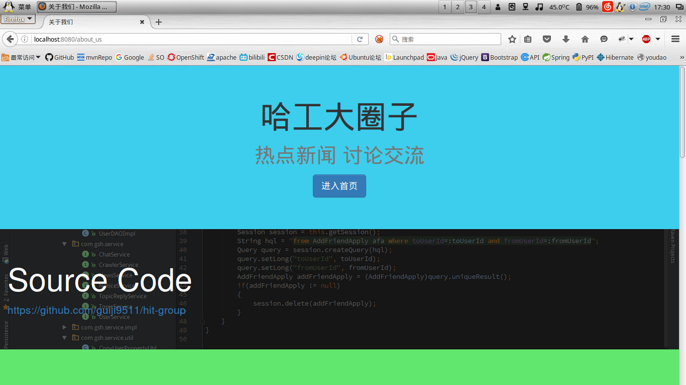

# 哈尔滨工业大学大三上软件工程课程实践项目

## 题目

11、工大圈子

构建一个属于工大人自己的圈子，该圈子可以很好的共享工大的信息，并且推荐每天today(today.hit.edu.cn)网站上的热点新闻、热点人物及热点话题。

功能至少包括：热点新闻推荐，热点话题和热点人物推荐，好友关注，用户留言等。

##### 声明
今天无意中看到其他同学搜索到并下载浏览我们的项目，我很高兴，欢迎大家参考我们的代码，但请注意遵守开源协议，以及作为一门课程的作业，尽量不要抄袭。

## 第一次迭代预计实现功能

* 数据采集爬虫抓取新闻信息
* 新闻分类展示
	+ 新闻评论功能
* 好友社交系统
	+ 好友系统
	+ 私信功能
	+ 关注功能
	+ 讨论组系统
* 后台管理系统

## 第二次迭代预计实现功能

* bug修复
* 讨论组加入主题分类
* 讨论组改为私有模式

## 组员

* hit1140320209
* hit1140320208
* hit1140320210

## 更新日志

### 第一次迭代

* 2016-9-7 需求分析和编写文档
* 2016-9-8 数据库设计基本完成
* 2016-9-9 搭建开发环境
* 2016-9-10 大致设计好接口
* 2016-9-11 写完网站业务层和DAO层并完成单元测试
* 2016-9-12 首页&登陆&注册
* 2016-9-13 新闻页
* 2016-9-14 关于我们&讨论组主页
* 2016-9-15 大量页面和前端控制器
* 2016-9-16 后台管理&朋友圈&验证码&密码散列
* 2016-9-22 测试部署,部署环境适配
* 2016-9-30 License
* 2016-11-6 爬虫模块API&gitignore&dev branch
* 2016-11-15 配置文件bug修复
* 2016-11-15 合并爬虫模块

### 第二次迭代
* 2016-11-24 第二次迭代前准备，整理项目结构和文档
* 2016-11-29 数据库更新&DAO层&Service层(未测试)
* 2016-11-30 数据库修改&DAO补充&Service补充&新页面和旧页面修改

### 项目状态
第二次迭代网站部分基本完成，进入优化和测试阶段

## 图

